# 📉 Customer Churn Prediction

Predicting telecom customer churn with machine learning — deployed as an interactive, self-explaining Streamlit app.

[Overview](#-overview) • [App Features](#️-app-features) • [Key Insights](#-key-insights) • [Pipeline](#-pipeline) • [Results](#-model-results) • [Getting Started](#-getting-started) • [Author](#-author)

---

## 📖 Overview

An end-to-end churn prediction pipeline on the Telco Customer Churn dataset — raw data to a deployed, interactive web app. Enter a customer's profile, get a churn risk score and the reasons behind it.

- Cleans and encodes raw customer data (demographics, services, billing)
- Trains and compares three classification models
- Serves the best model through a live Streamlit dashboard for real-time, explainable predictions

---

## 🖥️ App Features

- **Real-time prediction** — churn probability (0–100%) with an animated risk meter and severity pill (low / moderate / high)
- **Primary risk factors** — top drivers behind each prediction as plain-language cards tagged `+ Risk` or `− Risk`
- **Sample profiles** — one-click High / Low / Moderate presets, plus a reset button
- **Customer snapshot** — summarized view of the inputs behind the current prediction
- **Interpretable by design** — factor explanations come from the logistic regression coefficients, not a black box
- **Polished UI** — staggered card animations, count-up risk score, hover transitions, `prefers-reduced-motion` support

---

## 💡 Key Insights

| Signal | Observation |
|---|---|
| **Contract type** | Month-to-month customers churn far more than 1- or 2-year holders — the strongest predictor |
| **Tenure** | Churn is concentrated in the first few months; customers past ~1 year are far more likely to stay |
| **Internet service** | Fiber optic subscribers churn more than DSL or no-internet customers |
| **Payment method** | Electronic check users churn more than automatic payment methods |
| **Monthly charges** | Higher bills correlate with higher churn risk |

These match the top features ranked by the model's own coefficients, and surface in the app as per-prediction risk cards.

---

## 🧩 Pipeline

```mermaid
flowchart LR
    A[Raw CSV<br/>Telco-Customer-Churn.csv] --> B[Clean & Impute<br/>TotalCharges, drop ID]
    B --> C[One-Hot Encode<br/>categorical features]
    C --> D[Train / Test Split<br/>80 / 20, stratified]
    D --> E[Scale numeric features<br/>StandardScaler]
    E --> F[Train Models<br/>LogReg · RF · XGBoost]
    F --> G[Select Best Model<br/>Logistic Regression]
    G --> H[Serialize<br/>model · scaler · columns]
    H --> I[Streamlit App<br/>real-time explainable prediction]
```


Reproducible two ways:

- **`app/train_model.py`** — one-click script: cleans, trains Logistic Regression, prints metrics, saves all model artifacts (auto-downloads the dataset if missing)
- **`notebooks/01_EDA_and_Preprocessing.ipynb`** — full EDA + three-model comparison behind the results table below

---

## 🏆 Model Results

| Model | Precision (churn) | Recall (churn) | F1 (churn) | ROC-AUC |
|---|---|---|---|---|
| **Logistic Regression (selected)** | 0.65 | 0.55 | — | ~0.84 |
| Random Forest | 0.63 | 0.51 | 0.56 | ~0.83 |
| XGBoost | 0.58 | 0.50 | 0.54 | ~0.82 |

Logistic Regression was selected for deployment — matched or beat the ensemble models on ROC-AUC while staying fully interpretable.

---

## 📁 Project Structure

```
Customer-Churn-Prediction/
│
├── app/
│   ├── app.py                          # Streamlit prediction dashboard
│   ├── train_model.py                  # one-click training script (auto-downloads data)
│   ├── data/
│   │   └── Telco-Customer-Churn.csv    # raw dataset (auto-downloaded on first run)
│   └── models/
│       ├── churn_model.pkl             # trained Logistic Regression model
│       ├── scaler.pkl                  # fitted StandardScaler
│       └── model_columns.pkl           # training-time feature column order
│
├── notebooks/
│   └── 01_EDA_and_Preprocessing.ipynb  # EDA, cleaning, model comparison
│
├── requirements.txt
├── LICENSE
└── README.md
```

---

## 🛠️ Tech Stack

Python · Pandas · NumPy · scikit-learn · XGBoost · Streamlit · Matplotlib · Seaborn · joblib

---

## 🚀 Getting Started

### 1. Clone the repo
```bash
git clone https://github.com/ibrahimkhan-data/Customer-Churn-Prediction.git
cd Customer-Churn-Prediction
```

### 2. Install dependencies
```bash
pip install -r requirements.txt
```
> Requires Streamlit ≥ 1.29 (the dashboard uses bordered containers). `requirements.txt` pins this.

### 3. Train the model (one command)
```bash
python app/train_model.py
```
Downloads the dataset automatically (saved to `app/data/`), trains the model, prints accuracy / ROC-AUC, and generates the three `.pkl` artifacts in `app/models/`. You can also place `Telco-Customer-Churn.csv` in `app/data/` yourself.

### 4. Launch the app
```bash
streamlit run app/app.py
```
Fill in a customer's details (or click a sample profile) and hit **Predict churn**.

### 5. (Optional) Re-run the full EDA / model comparison
```bash
jupyter nbconvert --to notebook --execute --inplace notebooks/01_EDA_and_Preprocessing.ipynb
```

---

## 🔮 Future Improvements

- [ ] Hyperparameter tuning (GridSearch / Optuna) for Random Forest and XGBoost
- [ ] Handle class imbalance explicitly (SMOTE / class weighting)
- [ ] Add SHAP explanations alongside the existing coefficient-based factor cards
- [ ] Batch prediction via CSV upload
- [ ] Deploy to Streamlit Community Cloud for a public demo

---

## 👤 Author

**Khan Ibrahim**
B.Tech — Artificial Intelligence & Data Science

[GitHub](https://github.com/ibrahimkhan-data)

### Note on AI Assistance
Core ideas, dataset choice, and direction were mine. An AI assistant helped with debugging, writing/refactoring parts of the code (notably the Streamlit dashboard and preprocessing alignment), and drafting this README.

---

## License

MIT License — free to use, modify, and build on, with attribution.
