<div align="center">

# 📉 Customer Churn Prediction

**Predicting telecom customer churn with machine learning — deployed as an interactive, explainable Streamlit dashboard.**

[](https://www.python.org/)
[](https://streamlit.io/)
[](https://scikit-learn.org/)
[](LICENSE)

[Overview](#-overview) •
[App Features](#-app-features) •
[Key Insights](#-key-insights) •
[Pipeline](#-pipeline) •
[Results](#-model-results) •
[Getting Started](#-getting-started) •
[Author](#-author)

</div>

---

## 📖 Overview

An end-to-end churn prediction pipeline on the [Telco Customer Churn](https://www.kaggle.com/datasets/blastchar/telco-customer-churn) dataset — from raw data to a deployed, interactive web app. Enter a customer's profile and get a churn risk score, along with the reasons behind it.

- Cleans and encodes raw customer data (demographics, services, billing)
- Trains and compares three classification models
- Serves the best model through a live Streamlit dashboard for real-time, explainable predictions

---

## 🖥️ App Features

- **Real-time prediction** — churn probability (0–100%) with a color-coded risk meter and severity pill (low / moderate / high)
- **Primary risk factors** — top drivers behind each prediction, computed live from the model's own logistic regression coefficients, tagged `+ Risk` or `− Risk`
- **Sample profiles** — one-click High / Low / Moderate presets that pre-fill the whole form, plus a reset button
- **Customer snapshot** — quick summary of the inputs behind the current prediction
- **Interpretable by design** — factor explanations reflect the actual trained model, not hardcoded text

---

## 💡 Key Insights

Exploratory analysis on ~7,000 customers surfaced a few clear churn drivers:

| Signal | Observation |
|---|---|
| **Contract type** | Month-to-month customers churn far more than 1- or 2-year holders — the strongest predictor |
| **Tenure** | Churn is concentrated in the first few months; customers past ~1 year are far more likely to stay |
| **Internet service** | Fiber optic subscribers churn more than DSL or no-internet customers |
| **Payment method** | Electronic check users churn more than automatic payment methods |
| **Monthly charges** | Higher bills correlate with higher churn risk |

These match the top features ranked by the model's own coefficients, and surface live in the app as per-prediction risk factor cards.

---

## 🧩 Pipeline

```mermaid
flowchart LR
    A[Raw CSV<br/>Telco-Customer-Churn.csv] --> B[Clean & Impute<br/>TotalCharges, drop ID]
    B --> C[One-Hot Encode<br/>categorical features]
    C --> D[Train / Test Split<br/>80 / 20, stratified]
    D --> E[Scale numeric features<br/>StandardScaler]
    E --> F[Train Models<br/>LogReg · RF · XGBoost]
    F --> G[Select Best Model<br/>Logistic Regression]
    G --> H[Serialize<br/>model · scaler · columns]
    H --> I[Streamlit App<br/>real-time explainable prediction]
```



All training and evaluation happens in `notebooks/01_EDA_and_Preprocessing.ipynb` — EDA, cleaning, encoding, scaling, and the three-model comparison behind the results table below. The last cell saves `churn_model.pkl`, `scaler.pkl`, and `model_columns.pkl` into `models/`, which `app/app.py` loads directly.

---

## 🏆 Model Results

| Model | Precision (churn) | Recall (churn) | F1 (churn) | ROC-AUC |
|---|:---:|:---:|:---:|:---:|
| **Logistic Regression (selected)** | 0.65 | 0.55 | — | **~0.84** |
| Random Forest | 0.63 | 0.51 | 0.56 | ~0.83 |
| XGBoost | 0.58 | 0.50 | 0.54 | ~0.82 |

Logistic Regression was selected for deployment — it matched or beat the ensemble models on ROC-AUC while staying fully interpretable, which is what powers the app's live risk-factor explanations.

---

## 📁 Project Structure

```
Customer-Churn-Prediction/
│
├── app/
│   └── app.py                          # Streamlit prediction dashboard
│
├── data/
│   └── Telco-Customer-Churn.csv        # raw dataset
│
├── models/
│   ├── churn_model.pkl                 # trained Logistic Regression model
│   ├── scaler.pkl                      # fitted StandardScaler
│   └── model_columns.pkl               # training-time feature column order
│
├── notebooks/
│   └── 01_EDA_and_Preprocessing.ipynb  # EDA, cleaning, training, evaluation
│
├── requirements.txt
├── LICENSE
└── README.md
```

---

## 🛠️ Tech Stack

`Python` · `Pandas` · `NumPy` · `scikit-learn` · `XGBoost` · `Streamlit` · `Matplotlib` · `Seaborn` · `joblib`

---

## 🚀 Getting Started

### 1. Clone the repo
```bash
git clone https://github.com/ibrahimkhan-data/Customer-Churn-Prediction.git
cd Customer-Churn-Prediction
```

### 2. Install dependencies
```bash
pip install -r requirements.txt
```

### 3. Generate the model artifacts
Run the notebook end to end — this creates `churn_model.pkl`, `scaler.pkl`, and `model_columns.pkl` in `models/`:
```bash
jupyter nbconvert --to notebook --execute --inplace notebooks/01_EDA_and_Preprocessing.ipynb
```

### 4. Launch the app
```bash
streamlit run app/app.py
```
Fill in a customer's details (or click a sample profile) and hit **Predict churn**.

---

## 🔮 Future Improvements

- [ ] Hyperparameter tuning (GridSearch / Optuna) for Random Forest and XGBoost
- [ ] Handle class imbalance explicitly (SMOTE / class weighting)
- [ ] Add SHAP explanations alongside the existing coefficient-based factor cards
- [ ] Batch prediction via CSV upload
- [ ] Deploy to Streamlit Community Cloud for a public demo

---

## 👤 Author

**Khan Ibrahim**

B.Tech — Artificial Intelligence & Data Science

[](https://github.com/ibrahimkhan-data/)

---

## Note on AI Assistance

This project was built as a learning exercise. Core ideas, dataset choice, and direction were mine, and an AI assistant was used for debugging, writing/refactoring parts of the code (notably the Streamlit dashboard and preprocessing alignment), and drafting this README.

---

## License

This project is licensed under the [MIT License](LICENSE) — free to use, modify, and build on, with attribution.
